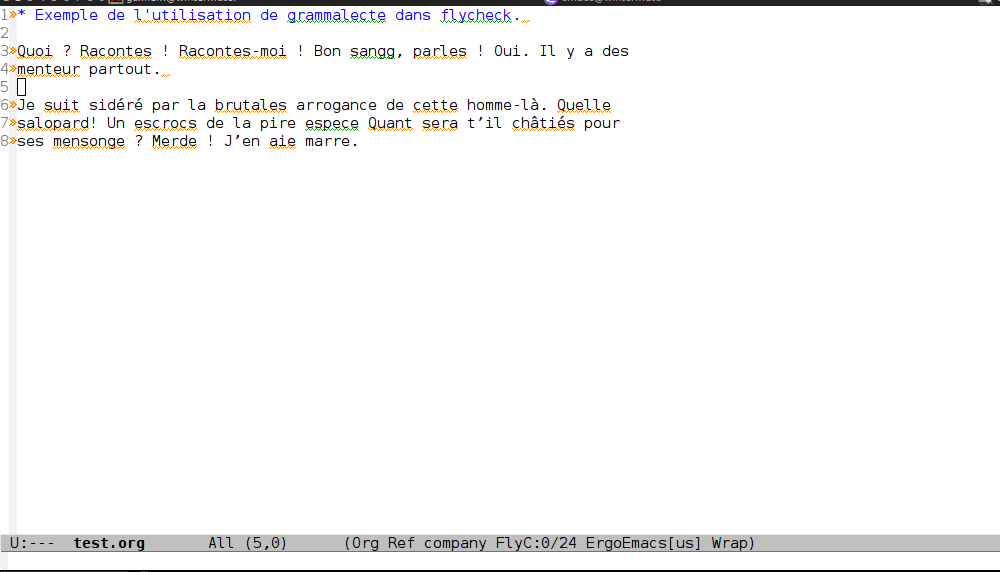

# Flycheck-grammalecte

Simple wrapper for the french language checking
tool [Grammalecte](http://www.dicollecte.org/grammalecte/)
and the [flycheck](http://www.flycheck.org/) emacs package. 



**This package is currently a quick hack-around. No particular care
has been taken to streamline the installation process. Feel free to contribute**

## Installation


You need to have the grammalecte python module available for `flycheck-grammalecte.py`.

Quick and dirty solution:

```
	cd flycheck-grammalecte/
	wget http://www.dicollecte.org/grammalecte/oxt/Grammalecte-v0.5.15.7z
	7z x Grammalecte-v0.5.15.7z
```

Then you need to evaluate `flycheck-grammalecte.el`, for instance add this to your `.emacs`:

```
	(load-file "<PATH>/flycheck-grammalecte/flycheck-grammalecte.el")
```

## Usage

In a org-buffer, type `M-x flycheck-mode`, `M-x flycheck-select-checker` and `francais-grammalecte`.
